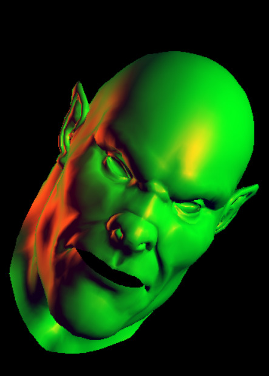

# Software-Rasterizer
3D viewer program with anttweakbar for GUI and freeglut minimally used. the graphics pipeline is coded by hand as a software renderer.
implemented diffuse , specular , ambient light. two positional light sources.
flat,gouroud and phong shader support
camera , world , object and 2 light sources rotation/position control

